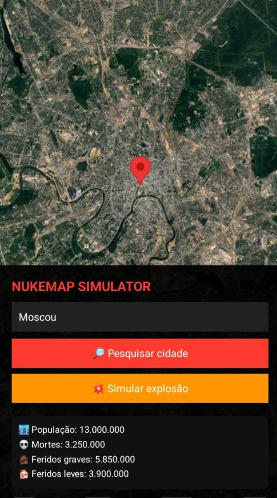
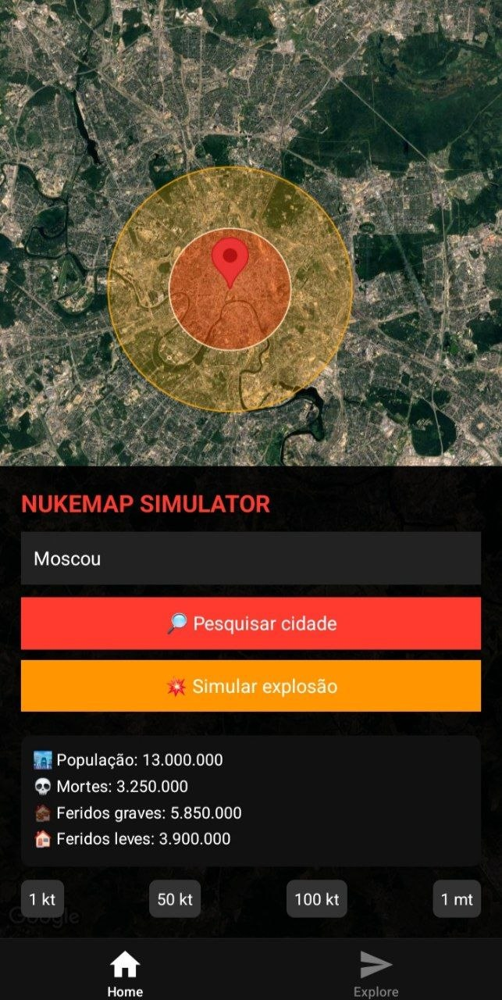

# 📱 NUKEMAP APP

Aplicativo mobile desenvolvido com React Native e Expo que utiliza mapas interativos para simulação de áreas de impacto geográfico em modo satélite.

O projeto exibe um ponto central com múltiplos círculos concêntricos representando diferentes níveis de alcance, aplicando conceitos de geolocalização e visualização de dados em mapas.

---

## 🚀 Tecnologias utilizadas

- React Native
- Expo
- react-native-maps
- JavaScript / TypeScript

---

## 📍 Funcionalidades

- Mapa interativo em modo satélite
- Marcador central de localização
- Círculos de simulação de impacto com diferentes raios
- Interface simples com painel informativo

---

## 🎯 Objetivo

Projeto desenvolvido para estudo e prática de desenvolvimento mobile, focando em mapas interativos, manipulação de coordenadas e renderização de elementos geográficos.

---

## 📸 Screenshots

### Tela principal





## 📦 Como executar o projeto

```bash
npm install
npx expo start
```
