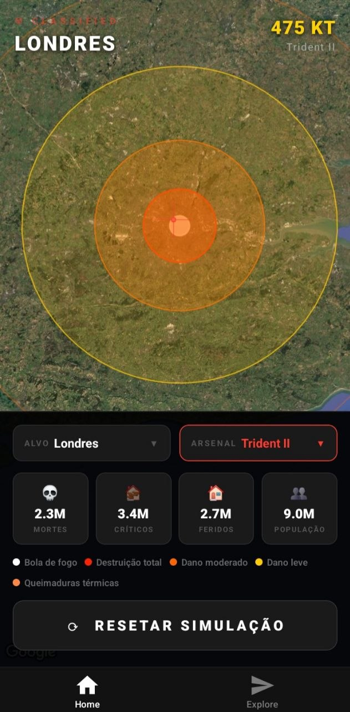
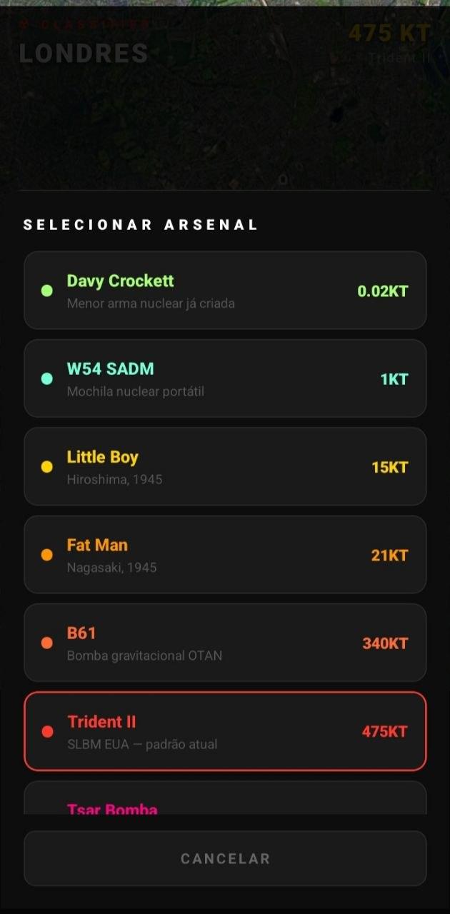

☢️ NUKEMAP APP

Simulador de impacto nuclear interativo desenvolvido com React Native + Expo.
Visualize zonas de destruição de armas nucleares reais sobre qualquer cidade do mundo, em modo satélite.

🗺️ Visão Geral
O NUKEMAP App combina geolocalização, mapas interativos e dados históricos reais para simular o impacto de diferentes armas nucleares sobre cidades do mundo. O usuário escolhe o alvo, seleciona o arsenal e visualiza as zonas de dano em tempo real sobre o mapa satélite.

⚙️ Funcionalidades

🛰️ Mapa interativo em modo satélite com estilo dark
☢️ 7 armas nucleares reais — do Davy Crockett (0.02 KT) à Tsar Bomba (50 MT)
🎯 5 zonas de dano com raios proporcionais à potência real da arma
💥 Animação de detonação — flash branco, shake do mapa e expansão das ondas
🏙️ 9 cidades pré-configuradas com população real (São Paulo, Tóquio, Nova York...)
📊 Estatísticas de impacto — mortes, feridos críticos, feridos leves e população total
🔍 Busca de cidade por nome
🎖️ HUD estilo militar com indicador de potência e status

🔴 Zonas de Dano Simuladas
ZonaDescrição⚪ Bola de fogoVaporização total — nada sobrevive🔴 Destruição totalColapso de estruturas, mortalidade ~100%🟠 Dano moderadoEdifícios destruídos, mortalidade alta🟡 Dano leveJanelas quebradas, ferimentos graves🟤 Queimaduras térmicasQueimaduras de 3º grau a céu aberto

## 🚀 Tecnologias utilizadas

- React Native
- Expo
- react-native-maps
- JavaScript / TypeScript
- Expo Location
- Expo Vector Icons

## 📸 Screenshots

### Tela principal

🚀 Como executar
bash# 1. Instalar dependências
npm install

# 2. Iniciar o projeto

npx expo start
Depois escaneie o QR Code com o app Expo Go (Android / iOS).

⚠️ Aviso
Este aplicativo é estritamente educacional e de entretenimento.
Nenhuma informação aqui representa capacidade operacional real de qualquer nação.
