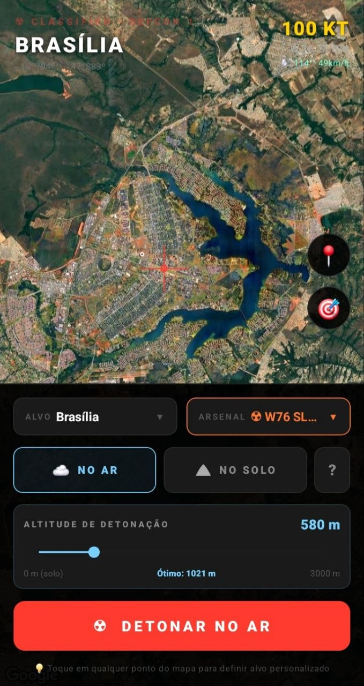
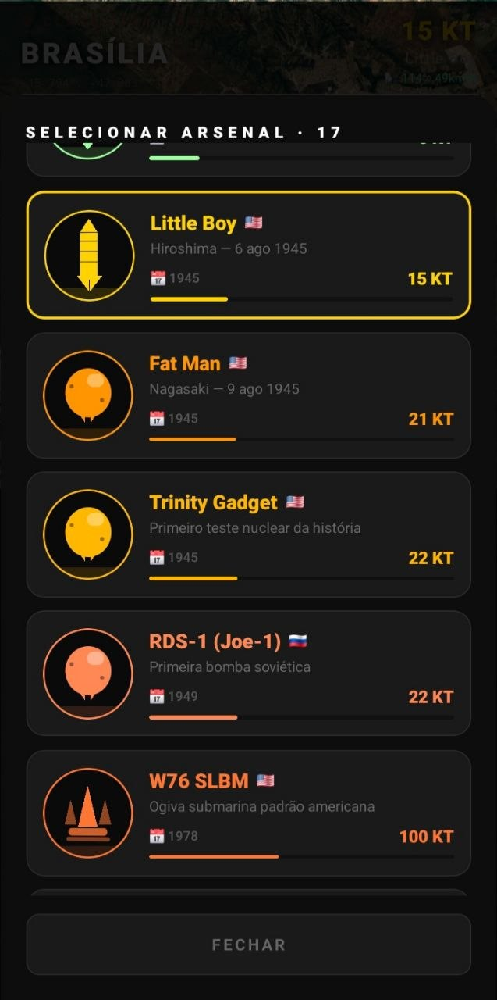
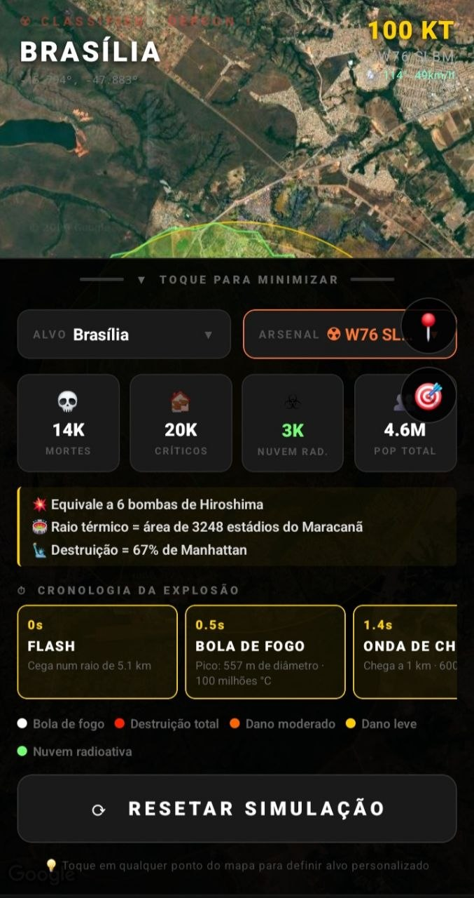
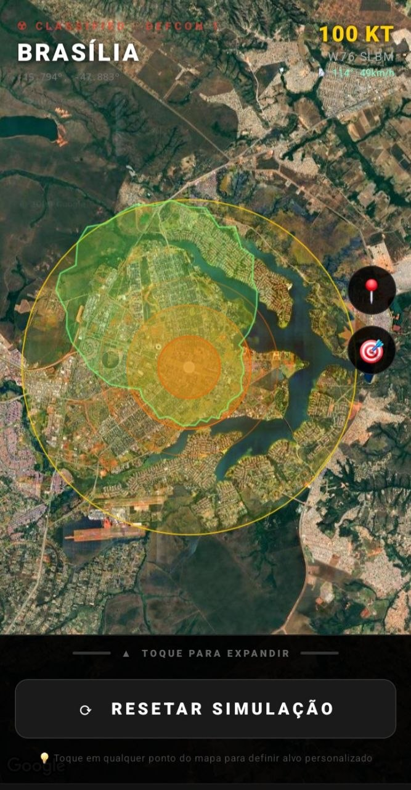

# ☢️ NUKEMAP APP


[](https://nukemap-app.vercel.app)
[](https://expo.dev/accounts/pedroaruana/projects/nukemap-app/builds/45dbb263-e5c5-4297-bf0c-087814388383)


> 🌐 **[Acesse a demo online →](https://nukemap-app.vercel.app)** _(versão web com Leaflet/OpenStreetMap)_
>
> 📱 **[Baixar APK Android →](https://expo.dev/accounts/pedroaruana/projects/nukemap-app/builds/45dbb263-e5c5-4297-bf0c-087814388383)** _(versão mobile completa com áudio + haptics + Google Maps)_

Aplicativo mobile interativo desenvolvido com **React Native + Expo** para simulação realista de impacto nuclear em escala urbana. Utiliza modelos científicos do **Glasstone-Dolan** (manual oficial americano de efeitos de armas nucleares) e dados de Hiroshima/Nagasaki para calcular zonas de dano, vítimas e fallout radioativo com precisão calibrada contra o **NUKEMAP** original de Alex Wellerstein.

---

## 🧠 Objetivo

Demonstrar domínio de desenvolvimento mobile multiplataforma, integração com mapas geoespaciais, modelagem matemática realista, design de UI/UX e construção de simuladores interativos de alta fidelidade visual.

---

## ⚙️ Funcionalidades

### 🌍 Geolocalização

- **57 cidades globais** pré-configuradas com população e densidade urbana reais
- **GPS do dispositivo** — detona na sua localização atual
- **Toque no mapa** — define alvo personalizado em qualquer ponto do globo
- Busca inteligente entre cidades

### 💣 Arsenal (17 armas)

Bombas reais com dados históricos, ano, país e descrição:

- **Davy Crockett** (0.02 KT) — menor arma nuclear já criada
- **Little Boy** (15 KT) — Hiroshima, 1945
- **Fat Man** (21 KT) — Nagasaki, 1945
- **Trinity Gadget**, **RDS-1 (Joe-1)**, **B61-12**, **B83**, **W76**, **W88**, **Trident II D5**, **DF-41**, **RS-24 Yars**, **R-36 Satan** e mais
- **Tsar Bomba** (50 MT) — maior explosão da história

Cada arma renderizada com **modelo 3D em silhueta real** (gravity bomb, esfera Fat Man, MIRV cluster ou Tsar) girando em `rotateY` com perspectiva.

### ☁ Tipo de Detonação Obrigatória

Antes de detonar, escolha entre:

- **NO AR (air burst)** — onda reflete no solo, +30% raio destrutivo, pouco fallout (estratégia de Hiroshima)
- **NO SOLO (ground burst)** — cratera real, fallout 4–5× maior, contaminação de décadas

Botão **?** abre explicação detalhada da diferença prática.

### 📐 Slider de Altitude (Air Burst)

Quando selecionado "NO AR", aparece slider 0–3000m mostrando a **altitude ótima de detonação** calculada (`220 × ∛kt`). Para 15kt, o ótimo dá 543m — Hiroshima foi a 580m, real. Eficiência cai parabolicamente ao se afastar do ideal.

### 📊 Modelo Físico Realista

- **Raios de explosão**: lei de raiz cúbica de Glasstone-Dolan (`R = constante × ∛kt`) calibrada para fireball, 20psi, 5psi, 1psi e térmica
- **Vítimas**: área de cada zona × densidade urbana × taxa de mortalidade real:
  - Bola de fogo: 98% mortos
  - 20 psi: 90% mortos
  - 5 psi: 50% mortos / 45% críticos
  - Anel térmico: 25% mortos por queimaduras 3º grau
  - 1 psi: 5% mortos / 25% críticos
- **Cratera (ground burst)**: `45 × kt^0.3` metros, visível permanentemente no mapa
- **Fallout radioativo**: polígono em forma de gota alongado pela direção do vento (aleatório por sessão), com intensidade modulada pelo tipo de detonação

### 🎬 Animações

- Sequência: sirene 2.2s → flash branco → camera shake → fireball expansão → shockwave → cogumelo nuclear simulado
- 5 ondas de explosão concêntricas progressivas
- Cratera persistente após ground burst
- Fallout animado se expandindo com o vento
- Auto-zoom no mapa para enquadrar a explosão inteira

### 🎮 Feedback Tátil (Haptics)

Sequência de impactos pesados sincronizados com a detonação via `expo-haptics`.

### ⏱ Timeline da Detonação

Strip horizontal mostrando a cronologia em tempo real:

- `0s` Flash cega
- `0.5s` Bola de fogo no pico (100 milhões °C)
- `1.4s` Onda de choque chega a 1km
- `40s` Cogumelo atinge estratosfera
- `15min` Fallout começa a cair

### 📏 Comparações Intuitivas

Os números absolutos não dizem muito pra leigos. O app traduz para escalas familiares:

- _"Equivale a X bombas de Hiroshima"_
- _"Raio térmico = área de N estádios do Maracanã"_
- _"Destruição = X% de Manhattan"_

### 📦 Painel Minimizável

Após a detonação, um handle no topo do painel permite minimizar todos os dados pra ver o mapa inteiro, e reabrir com um toque.

---

## 📊 Diferenciais Técnicos

- **Fórmulas físicas reais** baseadas em literatura científica oficial (Glasstone-Dolan, dados pós-Hiroshima)
- **Densidade urbana específica por cidade** — Karachi (24.000/km²) destrói diferente de Brasília (480/km²)
- **17 modelos 3D de bombas** renderizados com primitivos do RN (Views + transforms), zero dependência externa de 3D
- **Cálculo de fallout vetorizado** pela direção do vento (polígono em gota)
- **Interface HUD militar** com tipografia mono, crosshair, código DEFCON, classificação CONFIDENTIAL
- **Auto-zoom adaptativo** — explosão da Tsar Bomba cobre 60+ km de raio, mapa se ajusta automaticamente

---

## 📸 Screenshots

### Tela principal






---

## 🚀 Como executar

```bash
# 1. Instalar dependências
npm install

# 2. Iniciar o projeto
npx expo start
```

Escaneie o QR Code com o app **Expo Go** (Android / iOS).

---

## ⚠️ Aviso

Este aplicativo é **estritamente educacional e de entretenimento**. Os modelos físicos, embora calibrados contra literatura científica pública, são simplificações didáticas. Nenhuma informação aqui representa capacidade operacional real de qualquer nação ou sistema de armas.

O propósito é ilustrar a escala absurda das armas nucleares de forma que números absolutos não conseguem comunicar — e reforçar por que essas armas jamais devem ser usadas.

---

## 👤 Autor

**Pedro Aruana**

[](https://github.com/Pedroaruana)

Projeto desenvolvido por **Pedro Aruana** como demonstração de habilidades em desenvolvimento mobile, modelagem física e design de UI/UX.

---

<p align="center">
  Feito com ☢️ por <b>Pedro Aruana</b>
</p>
